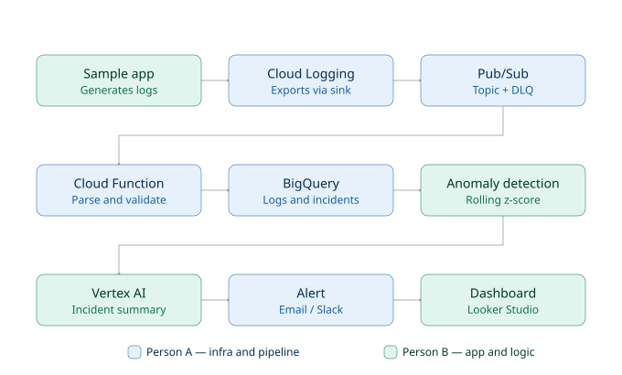

# Incident/Log Anomaly Detector

A GCP-based automated incident and log anomaly detection system, built as a
2-person internship project. Ingests application logs from a sample
e-commerce app, detects anomalies (error spikes, latency spikes) using
statistical methods, and auto-generates incident summaries with alerts.

## What it does

1. A sample e-commerce app generates logs (normal traffic + injectable
   error/latency spikes)
2. Logs are exported via a Cloud Logging sink into Pub/Sub
3. A Cloud Function parses and validates each log, writing valid entries to
   BigQuery (malformed entries go to a dead-letter table)
4. Statistical anomaly detection (z-score / moving average) runs against
   the log stream
5. When an anomaly is detected, Vertex AI generates a natural-language
   incident summary
6. An alert is sent to Slack and the incident appears on a dashboard

## Architecture

```
Sample App → Cloud Logging → Pub/Sub → Cloud Function (parse/validate)
    → BigQuery → Anomaly Detection → Vertex AI Summary → Alert → Dashboard
```

See [`docs/adr.md`](docs/adr.md) for the reasoning behind key architecture
decisions (Pub/Sub + Cloud Functions over GKE + Kafka; deferred
per-component service accounts).

## Team

- **Person A (Infra & Pipeline):** GCP setup, Cloud Logging sink, Pub/Sub,
  ingestion Cloud Function, BigQuery, Cloud Monitoring/alerting, Terraform,
  CI/CD, notification delivery
- **Person B (App, Logic & Presentation):** Sample log-generating app,
  anomaly detection logic, Vertex AI incident summaries, dashboard

## Repo structure

```
├── .github/workflows/     — CI (Python tests + Terraform validation on every PR)
├── app/
│   ├── sample-app/         — sample e-commerce app + traffic generator
│   ├── detection/           — ingestion Cloud Function, anomaly detector,
│   │                          Vertex AI summary generation, Slack notifications
│   └── dashboard/            — dashboard (Looker Studio config / assets)
├── docs/
│   ├── schema.md             — locked log schema, the contract between app and pipeline
│   └── adr.md                 — architecture decision records
├── infra/
│   └── terraform/              — infrastructure as code (Pub/Sub, BigQuery, Monitoring, etc.)
├── docker-compose.yml          — local dev setup (Pub/Sub emulator)
└── local-dev-README.md         — how to run the local dev environment
```

## Local development

See [`local-dev-README.md`](local-dev-README.md) for running against a
local Pub/Sub emulator instead of real GCP — no cost, no cloud credentials
needed for basic testing.

Quick start (four terminals):

```bash
# 1. Start the emulator
docker compose up -d pubsub-emulator

# 2. Sample app (app/sample-app)
$env:PUBSUB_EMULATOR_HOST = "localhost:8085"
$env:GOOGLE_CLOUD_PROJECT = "local-dev-project"
python -m uvicorn main:app --reload --port 8000

# 3. Traffic generator (app/sample-app)
python traffic_generator.py

# 4. Anomaly detector (app/detection)
python anomaly_detector.py
```

Trigger a demo anomaly:

```bash
curl -X POST http://localhost:8000/admin/trigger-error-burst
curl -X POST http://localhost:8000/admin/stop-error-burst
```

This full chain — traffic → detection → incident summary → Slack alert
attempt — has been run and verified locally end-to-end.

## Log schema

All log entries follow the schema defined in
[`docs/schema.md`](docs/schema.md). This is the contract between the
sample app and the ingestion pipeline — any change to it needs to be
agreed by both team members before code is updated.

## Infrastructure

All GCP infrastructure is managed via Terraform in `infra/terraform/`.
Resources are pinned to `us-west1` due to an org-level resource-location
policy on the GCP project — see `infra/terraform/variables.tf` for details.

Terraform is written and validated in CI, but has not yet been applied to
real GCP — pending confirmation from the team lead that resource creation
is cleared on the current project.

## CI/CD

GitHub Actions (`.github/workflows/ci.yml`) runs on every push/PR to
`main`:

- Python unit tests for the ingestion function
- Terraform format check + validate (no live GCP calls — credentials
  aren't wired into CI yet)

`main` is branch-protected — changes go through a PR with required review.

## Vertex AI integration

`app/detection/vertex_summary.py` contains a real Vertex AI (Gemini)
integration for generating incident summaries. It defaults to a templated
fallback summary (`USE_LIVE_VERTEX_AI=false`) and only calls the live API
when explicitly enabled — kept off until live GCP calls are cleared for
this project. If the live call ever fails, it falls back to the templated
summary automatically so the pipeline doesn't break.

## Notifications

`app/detection/notifications.py` sends incident alerts to Slack via
webhook. Reads the webhook URL from `SLACK_WEBHOOK_URL` — until that's
configured (pending Slack app setup), it logs a clear message and skips
sending rather than failing.

## Security notes

A repo-wide check (commit history, `.gitignore` coverage, committed
files) found no exposed secrets or credential files. Per-component
service accounts (one scoped identity per Cloud Function, rather than
shared defaults) were deliberately deferred — see
[ADR 002](docs/adr.md#adr-002-deferred--per-component-service-accounts)
for the reasoning and what a complete version would involve.

## Status

**Built and verified locally:**

- Sample app + traffic generator, generating realistic logs with
  injectable anomalies
- Ingestion Cloud Function (unit + integration tested)
- Anomaly detection (rolling z-score on latency and error rate)
- Incident summary generation (Vertex AI integration written, using
  templated fallback until live-enabled)
- Slack alerting (code complete, pending real webhook)
- Full pipeline wired and confirmed working end-to-end locally

**Written, not yet applied to real GCP:**

- All Terraform (Pub/Sub, BigQuery, Cloud Monitoring, logging sink)
- Live Vertex AI calls

**Not started:**

- Dashboard

**Open/pending:**

- Confirmation that live GCP resource creation and API calls are cleared
  for the current project
- Slack app + webhook creation

# Incident/Log Anomaly Detector

A GCP-based automated incident and log anomaly detection system, built as a
2-person internship project. Ingests application logs from a sample
e-commerce app, detects anomalies (error spikes, latency spikes) using
statistical methods, and auto-generates incident summaries with alerts.

## What it does

1. A sample e-commerce app generates logs (normal traffic + injectable
   error/latency spikes)
2. Logs are exported via a Cloud Logging sink into Pub/Sub
3. A Cloud Function parses and validates each log, writing valid entries to
   BigQuery (malformed entries go to a dead-letter table)
4. Statistical anomaly detection (z-score / moving average) runs against
   the log stream
5. When an anomaly is detected, Vertex AI generates a natural-language
   incident summary
6. An alert is sent to Slack and the incident appears on a dashboard

## Architecture

```
Sample App → Cloud Logging → Pub/Sub → Cloud Function (parse/validate)
    → BigQuery → Anomaly Detection → Vertex AI Summary → Alert → Dashboard
```

See [`docs/adr.md`](docs/adr.md) for the reasoning behind key architecture
decisions (Pub/Sub + Cloud Functions over GKE + Kafka; deferred
per-component service accounts).

## Team

- **Person A (Infra & Pipeline):** GCP setup, Cloud Logging sink, Pub/Sub,
  ingestion Cloud Function, BigQuery, Cloud Monitoring/alerting, Terraform,
  CI/CD, notification delivery
- **Person B (App, Logic & Presentation):** Sample log-generating app,
  anomaly detection logic, Vertex AI incident summaries, dashboard

## Repo structure

```
├── .github/workflows/     — CI (Python tests + Terraform validation on every PR)
├── app/
│   ├── sample-app/         — sample e-commerce app + traffic generator
│   ├── detection/           — ingestion Cloud Function, anomaly detector,
│   │                          Vertex AI summary generation, Slack notifications
│   └── dashboard/            — dashboard (Looker Studio config / assets)
├── docs/
│   ├── schema.md             — locked log schema, the contract between app and pipeline
│   └── adr.md                 — architecture decision records
├── infra/
│   └── terraform/              — infrastructure as code (Pub/Sub, BigQuery, Monitoring, etc.)
├── docker-compose.yml          — local dev setup (Pub/Sub emulator)
└── local-dev-README.md         — how to run the local dev environment
```

## Local development

See [`local-dev-README.md`](local-dev-README.md) for running against a
local Pub/Sub emulator instead of real GCP — no cost, no cloud credentials
needed for basic testing.

Quick start (four terminals):

```bash
# 1. Start the emulator
docker compose up -d pubsub-emulator

# 2. Sample app (app/sample-app)
$env:PUBSUB_EMULATOR_HOST = "localhost:8085"
$env:GOOGLE_CLOUD_PROJECT = "local-dev-project"
python -m uvicorn main:app --reload --port 8000

# 3. Traffic generator (app/sample-app)
python traffic_generator.py

# 4. Anomaly detector (app/detection)
python anomaly_detector.py
```

Trigger a demo anomaly:

```bash
curl -X POST http://localhost:8000/admin/trigger-error-burst
curl -X POST http://localhost:8000/admin/stop-error-burst
```

This full chain — traffic → detection → incident summary → Slack alert
attempt — has been run and verified locally end-to-end.

## Log schema

All log entries follow the schema defined in
[`docs/schema.md`](docs/schema.md). This is the contract between the
sample app and the ingestion pipeline — any change to it needs to be
agreed by both team members before code is updated.

## Infrastructure

All GCP infrastructure is managed via Terraform in `infra/terraform/`.
Resources are pinned to `us-west1` due to an org-level resource-location
policy on the GCP project — see `infra/terraform/variables.tf` for details.

Terraform is written and validated in CI, but has not yet been applied to
real GCP — pending confirmation from the team lead that resource creation
is cleared on the current project.

## CI/CD

GitHub Actions (`.github/workflows/ci.yml`) runs on every push/PR to
`main`:

- Python unit tests for the ingestion function
- Terraform format check + validate (no live GCP calls — credentials
  aren't wired into CI yet)

`main` is branch-protected — changes go through a PR with required review.

## Vertex AI integration

`app/detection/vertex_summary.py` contains a real Vertex AI (Gemini)
integration for generating incident summaries. It defaults to a templated
fallback summary (`USE_LIVE_VERTEX_AI=false`) and only calls the live API
when explicitly enabled — kept off until live GCP calls are cleared for
this project. If the live call ever fails, it falls back to the templated
summary automatically so the pipeline doesn't break.

## Notifications

Alerting is delivered via email through the Cloud Monitoring alert policy
(`infra/terraform/monitoring.tf`), sent to the address configured in
`alert_email` (`infra/terraform/variables.tf`).

A Slack integration (`app/detection/notifications.py`) was also built and
is ready to use, but a team Slack workspace does not currently exist —
email is the primary alerting path for now. If a Slack workspace is set
up later, only a webhook URL needs to be added
(`SLACK_WEBHOOK_URL` environment variable) — no code changes required.

## Security notes

A repo-wide check (commit history, `.gitignore` coverage, committed
files) found no exposed secrets or credential files. Per-component
service accounts (one scoped identity per Cloud Function, rather than
shared defaults) were deliberately deferred — see
[ADR 002](docs/adr.md#adr-002-deferred--per-component-service-accounts)
for the reasoning and what a complete version would involve.

## Status

**Built and verified locally:**

- Sample app + traffic generator, generating realistic logs with
  injectable anomalies
- Ingestion Cloud Function (unit + integration tested)
- Anomaly detection (rolling z-score on latency and error rate)
- Incident summary generation (Vertex AI integration written, using
  templated fallback until live-enabled)
- Slack alerting (code complete, ready if a workspace is ever set up)
- Email alerting via Cloud Monitoring (configured, applies once Terraform is run)
- Full pipeline wired and confirmed working end-to-end locally

**Written, not yet applied to real GCP:**

- All Terraform (Pub/Sub, BigQuery, Cloud Monitoring, logging sink)
- Live Vertex AI calls

**Not started:**

- Dashboard

**Open/pending:**

- Confirmation that live GCP resource creation and API calls are cleared
  for the current project


